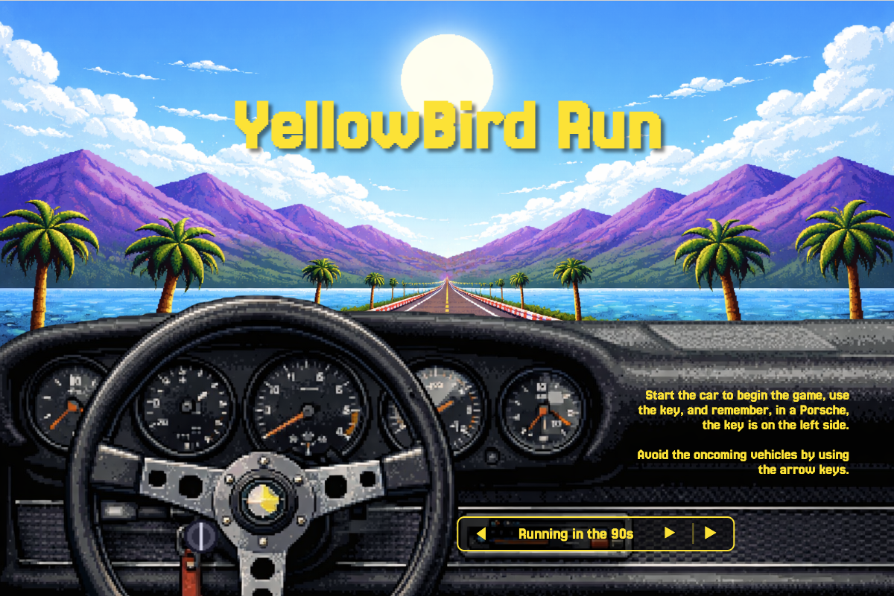

# 🚗 YellowBird Run

> A top-down arcade racer built with vanilla JavaScript, HTML and CSS. No frameworks. No game engine. Just code.

**[▶ Play it here](https://yellow-bird-run.vercel.app/)**



---

## About this project

YellowBird Run was one of the first projects I built during the Ironhack Web Development Bootcamp in Barcelona.

Only a few weeks before starting the bootcamp, I had never written a line of code. Programming felt like this huge world that I knew almost nothing about, and honestly, I never imagined I'd be able to build something like this so soon.

The challenge was simple: build a browser game using only HTML, CSS and vanilla JavaScript.

At first that sounded intimidating.

Looking back now, none of the ideas behind the game are particularly complex. There isn't a game engine doing the hard work for me. Every car on the screen is just an `` element moving around the DOM. Collisions are simple rectangle checks. The damage system is nothing more than swapping one sprite for another.

But that's exactly what surprised me.

This project made me realise that programming isn't about writing thousands of lines of complicated code. It's about taking a big problem, breaking it into lots of smaller ones, and solving them one at a time. Eventually those little pieces come together into something that actually feels alive.

I've learned a lot since then. Today I'd build many things differently, but I don't really want to remake this project. I like keeping it exactly as it is because it reminds me where I started.

---

## The game

Inspired by classic arcade racers like *Out Run*, YellowBird Run drops you onto an endless road where your only objective is to survive for as long as possible.

Features include:

- Endless enemy traffic with different vehicle types.
- Visual damage instead of a traditional health bar.
- Three lives before game over.
- A retro pixel art aesthetic.
- Music selection before each run.
- Engine sound generated with the Web Audio API.

---

## Something I enjoyed building

One feature I had a lot of fun experimenting with was the sound.

Instead of using prerecorded sound effects, I experimented with the Web Audio API to generate the engine, ignition and collision sounds directly in the browser.

I definitely had some help from AI while building this part. At the time I had no idea where to begin, so I used it as a way to learn rather than simply copy a solution. It introduced me to concepts like oscillators, filters and procedural audio—things I didn't even know browsers were capable of.

It's only a small part of the project, but it ended up being one of those rabbit holes that made me even more curious about web development.

---

## Tech stack

| | |
|---|---|
| **Language** | Vanilla JavaScript (ES6) |
| **Rendering** | DOM manipulation (no `<canvas>`) |
| **Audio** | Web Audio API + HTML5 Audio |
| **Styling** | CSS3 |
| **Deployment** | Vercel |

No dependencies. No build tools. No `node_modules`.

---

## Project structure

```text
YellowBird-Run/
├── index.html
├── styles.css
├── favicon.png
├── img/
│   ├── menu/
│   └── sprites/
├── sounds/
│   └── BSO/
└── js/
    ├── yellowBird.js
    ├── enemies.js
    ├── sounds.js
    ├── script.js
    └── menu.js
```

---

## Run it locally

The project needs to be served over HTTP.

```bash
git clone https://github.com/wildfont/YellowBird-Run.git
cd YellowBird-Run
npx serve
```

Or simply use the **Live Server** extension for VS Code.

> Browsers block audio until the user interacts with the page, so the engine won't make a sound until you start the game.

---

## Controls

| Action | Key |
|---------|-----|
| Start the engine | Click the Porsche key |
| Move | ← → |

---

## If I ever come back to this project

There are lots of things I'd like to improve one day:

- [ ] Add a score and high-score system.
- [ ] Make the difficulty increase over time.
- [ ] Add touch controls for mobile.
- [ ] Refactor the game loop into smaller pieces.
- [ ] Try building the rendering with Canvas.

---

## A small surprise

The sound wasn't supposed to work like this.

I was originally trying to play a couple of `.mp3` files for the engine and collisions, but while looking into it I discovered that all of those sounds could be generated directly in the browser with the Web Audio API.

I thought that was pretty amazing, so I decided to keep it. It's a tiny detail, but it was one of those moments during the bootcamp that made me stop and think, "I had no idea browsers could do that."

---

## Credits

Music tracks are included for demonstration purposes only and are not owned by me.